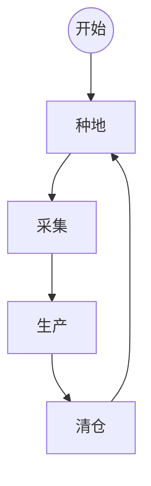
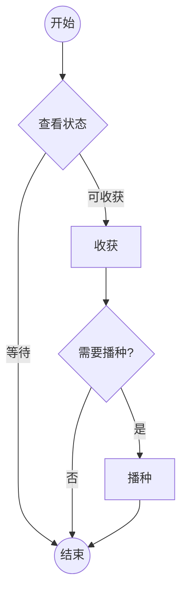
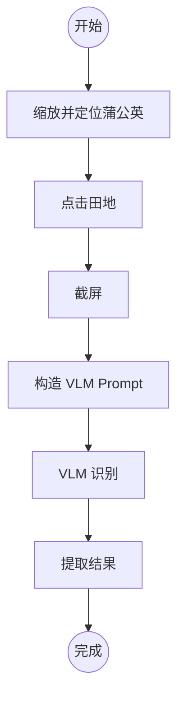
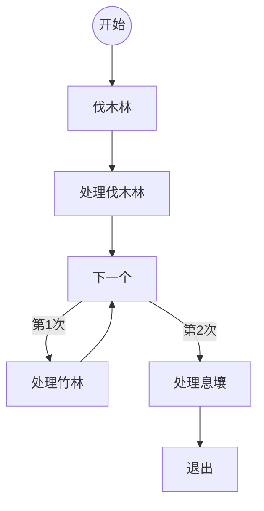
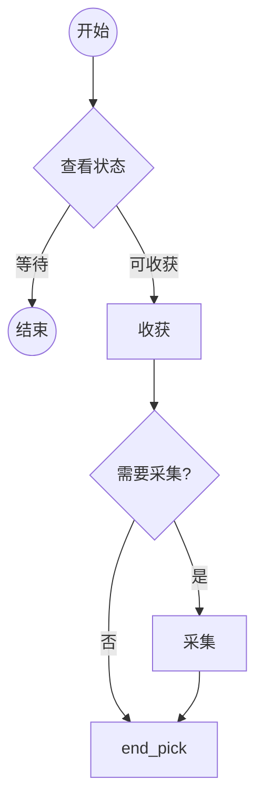
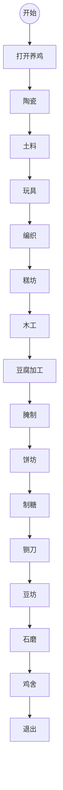
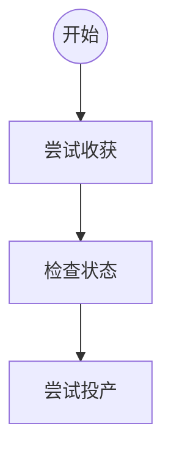
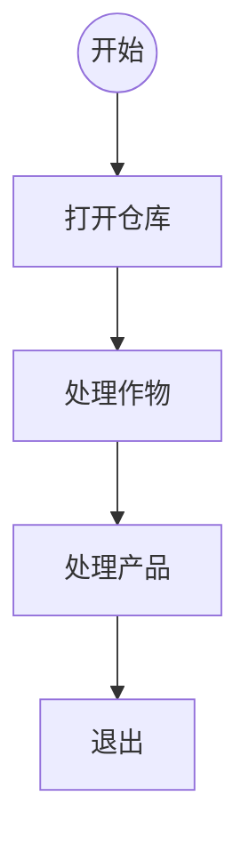

<p align="center">
  
</p>
<h1 align="center">🍃 桃源深处有人家 - 自动运营助手</h1>

<p align="center">
  基于 <strong>计算机视觉</strong> + <strong>大模型</strong> 的无人值守自动化运营系统
</p>

<p align="center">
  
  
  
  
</p>

---

## 📌 项目简介

本项目基于 **计算机视觉识别** 与 **自动化控制**，实现对《桃源深处有人家》的全自动运营。

核心策略如下：

* **资源不足 → 自动补种 / 投料**
* **资源过多 → 自动售卖**
* 系统循环执行「种地 → 采集 → 生产 → 清仓」四大流程，像生产线一样持续稳定运行。

---

## ✨ 功能亮点

### 🌱 自动种植

* 自动检测田地状态（是否可收获、是否需要播种）
* 自动收割 → 自动判断 → 自动播种
* 通过 VLM 准确识别土地状态，稳定可靠

### 🌳 自动采集

* 自动处理伐木林、竹林、息壤
* 根据识别结果判断是否需要采集
* 支持多轮连续采集流程

### 🏭 自动生产

覆盖全部生产建筑：

陶瓷 / 土料 / 玩具 / 编织 / 糕坊 / 木工 / 豆腐 / 腌制 / 饼坊 / 制糖 / 铡刀 / 豆坊 / 石磨 / 鸡舍等

* 自动收获产物
* 自动补料投产
* 按序遍历所有建筑，无需人工干预

### 🧹 自动清仓售卖

* 检测仓库容量
* 自动出售超过阈值的资源
* 始终保持仓库畅通

---

## 🎬 Demo 演示

📺 **[点此播放视频 Demo](https://www.bilibili.com/video/BV1KYyGBsExe)**
📄 **[点此查看程序输出日志 Demo](./demo.log)**

---

## 📮 反馈 & 交流群

QQ群：**1014644523**
群主即项目作者。

> TODO：作者是 23 级，目前游戏进度有限，因此生产设施支持范围基于现阶段认知。如果你在使用过程中愿意提供账号协助完善，欢迎联系我，让功能支持更全面、配置更自由。

---

# 🚀 快速开始

## 🖥️ 环境需求

1. Windows 系统电脑
2. 安装 **MuMu 模拟器**
3. 模拟器内安装《桃源深处有人家》
4. 模拟器窗口 **全屏模式（否则坐标会错位）**
5. 游戏内相机高度调至 **超远景**
6. 修改 `config.py`：

```python
os.environ["OPENAI_API_KEY"] = "你的智谱APIKey"
```

👉 [如何获取智谱 API Key](https://zhipu-ef7018ed.mintlify.app/cn/guide/start/quick-start)

---

## 🟩 方式一：运行源码

```bash
python main.py
```

缺哪个包就 `pip install` 哪个，依赖非常少。

---

## 🟦 方式二：直接使用可执行文件

* TODO：若有用户需要，我会提供打包好的 EXE 版本。

---

# 🔁 工作流程概览

> 小小感想：整个代码结构非常清晰，写出来时真的很享受这种“按想法落地”的过程。



---

# 🌱 种地流程



### 状态识别流程



---

# 🌲 采集流程



通用采集逻辑：



---

# 🏭 生产流程



通用生产逻辑：



---

# 🧹 清仓流程



---

# 📌 License

本项目仅供学习、研究与技术探索使用。
请勿将脚本用于任何违反游戏规则或破坏游戏平衡的行为。
