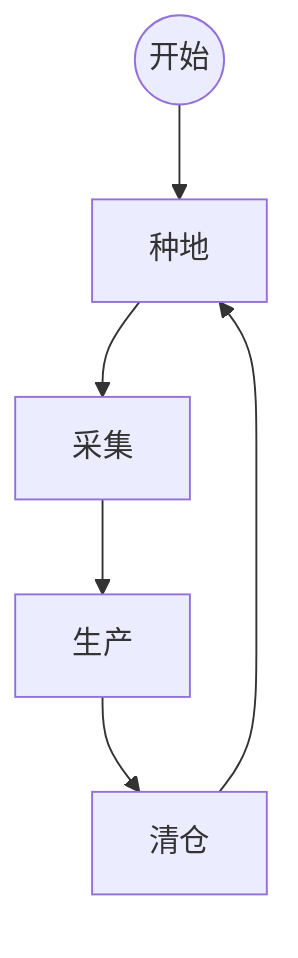
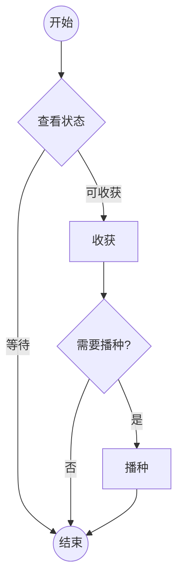
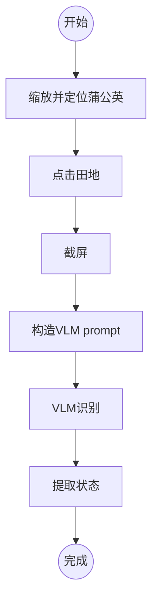
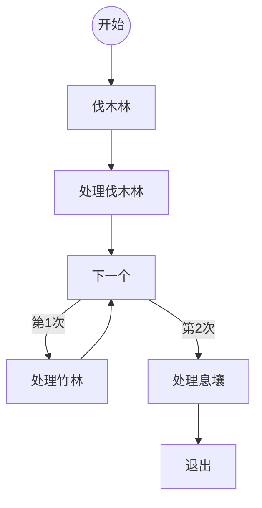
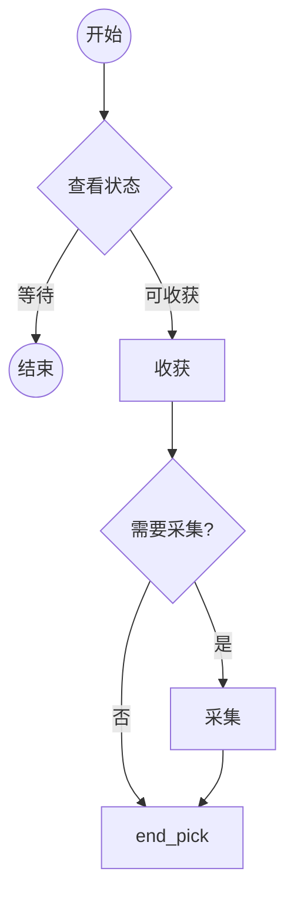
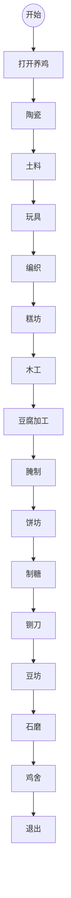
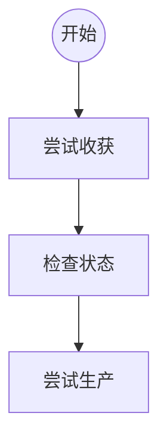
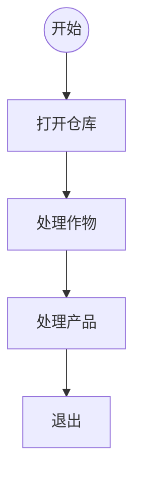

<p align="center">
  
</p>
<h1 align="center">🍃 桃源深处有人家 - 自动运营助手</h1>

<p align="center">
  基于计算机视觉 + 大模型的全自动运营系统
</p>

<p align="center">
  
  
  
  
</p>

---

## 📌 项目简介

本项目利用 **计算机视觉识别** 与 **自动化控制**，实现无人值守的自动化游戏运营。

核心策略：

* **资源不足 → 自动补种/补料**
* **资源过多 → 自动售卖**

系统会循环执行 *种地 → 采集 → 生产 → 清仓* 四大流程，像工厂一样稳定运行。

---

## ✨ 功能亮点

### 🌱 自动种植

* 自动判断田地是否可收获
* 自动收割 → 自动判断 → 自动播种
* 通过 VLM 识别土地状态，准确率高

### 🌳 自动采集

* 自动处理：伐木林、竹林、息壤
* 识别资源状态 → 选择是否采集

### 🏭 自动生产

支持全部生产建筑：
陶瓷 / 土料 / 玩具 / 编织 / 糕坊 / 木工 / 豆腐 / 腌制 / 饼坊 / 制糖 / 铡刀 / 豆坊 / 石磨 / 鸡舍等

* 自动收获
* 自动投料生产

### 🧹 自动清仓售卖

* 检测库存上限
* 自动卖掉“超过阈值”的物品
* 保持仓库流通

---

## 🎬 Demo 演示

📺 **[点击播放视频 demo](./demo.mp4)**
 **[点击查看视频对应程序输出 demo](./demo.log)**

---

## 📮 反馈 & 交流群

QQ群：**1014644523**
群主是作者。

- TODO:作者是23级，所以目前生产范围限制在这个水平，多的不清楚机制了，如果这个项目有人用，请联系我让我有动力和用您贡献的账号去完善，让每个人都能自定义配置

---

# 🚀 快速开始

## 🖥️ 环境要求

1. 一台 Windows 电脑
2. 安装 **MuMu 模拟器**
3. 模拟器中安装 **《桃源深处有人家》**
4. 将 MuMu 模拟器窗口**全屏（不要留白边）**
5. 在游戏内设置相机高度为**超远景** 
6. 修改 `config.py`：

   ```python
   os.environ["OPENAI_API_KEY"] = "你的智谱APIKey"
   ```

   👉 [如何获取智谱 API Key](https://zhipu-ef7018ed.mintlify.app/cn/guide/start/quick-start)

---


## 🟩 方式一：运行源码

```bash
python main.py
```

缺啥包就 `pip install` 哪个，依赖极少。


## 🟦 方式二：下载可执行文件

- TODO：如果有人会用，我后续有空打包一个。

---

# 🔁 工作流程概览

碎碎念：我的代码结构很清晰，按想法写出来的过程简直是一种享受




---

# 🌱 种地流程



### 状态识别流程



---

# 🌲 采集流程



通用采集逻辑：



---

# 🏭 生产流程



通用生产逻辑：



---

# 🧹 清仓流程



---

# 📌 License

本项目仅供学习与技术研究使用，请勿将脚本用于任何违反游戏规则或破坏游戏平衡的行为。

